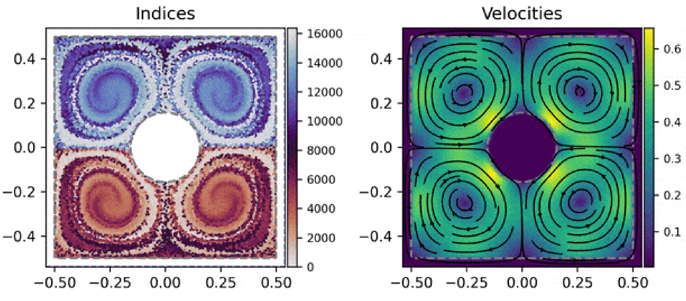

<!-- # diffSPH - A Framework for differentiable SPH Simulations -->

diffSPH is an open-source Smoothed Particle Hydrodynamics simulation framework built for adjoint problem solving and machine learning applications. diffSPH is written mostly in Python using PyTorch but also supports C++/CUDA extensions. The fundamentally differentiable nature of diffSPH make it a versatile basis for many different applications of SPH. Stay tunes for more details on the applications and design of diffSPH!

## Installation

The only major requirement for this solver is our companion software that handles the neighbor searching and related topics, which you can find more about [here](https://github.com/wi-re/torchCompactRadius). Other than that the solver is straightforward to setup and can also be used in Google colab

```
conda create --name sphEnv python=3.12
conda activate sphEnv
conda install -c anaconda ipykernel -y
conda install nvidia/label/cuda-12.8.1::cuda-toolkit cudnn
pip3 install torch torchvision torchaudio --index-url https://download.pytorch.org/whl/cu128
git clone https://https://github.com/wi-re/torchCompactRadius
cd torchCompactRadius
python setup.py develop
cd ..
https://github.com/tum-pbs/diffSPH
cd diffSPH
pip install -e .
```


## Examples

### Compressible Flows

<table>
    <tbody>
        <tr>
            <td style="width: 25%;"><a href="https://github.com/tum-pbs/diffSPH/blob/main/examples/compressible/rayleighTaylor2d.ipynb"></a></td>
            <td style="width: 25%;"><a href="https://github.com/tum-pbs/diffSPH/blob/main/examples/compressible/KevinHelmHoltz.ipynb"></a></td>
            <td style="width: 25%;"><a href="https://github.com/tum-pbs/diffSPH/blob/main/examples/compressible/sod_1d.ipynb"></a></td>
            <td style="width: 25%;"><a href="https://github.com/tum-pbs/diffSPH/blob/main/examples/compressible/sedov_2d.ipynb"></a></td>
        </tr>
        <tr>
            <td align="center">Rayleigh-Taylor Instability</td>
            <td align="center">Kevin-Helmholtz Instability</td>
            <td align="center">Sod-Shock Tube</td>
            <td align="center">Sedov Blastwave</td>
        </tr>
    </tbody>
</table>

More examples can be found under examples/compressible

### Weakly Compressibe Flows

<table>
    <tbody>
        <tr>
            <td style="width: 34%;"><a href="https://github.com/tum-pbs/diffSPH/blob/main/examples/weaklyCompressible/05_TGV.ipynb"></a></td>
            <td style="width: 33%;"><a href="https://github.com/tum-pbs/diffSPH/blob/main/examples/weaklyCompressible/03_RotatingSquarePatch.ipynb"></a></td>
            <td style="width: 33%;"><a href="https://github.com/tum-pbs/diffSPH/blob/main/examples/weaklyCompressible/09_LDC.ipynb"></a></td>
        </tr>
        <tr>
            <td align="center">Taylor Green Vortex</td>
            <td align="center">Rotating Square Patch</td>
            <td align="center">Lid-Driven Cavity</td>
        </tr>
        <tr>
            <td style="width: 33%;"><a href="https://github.com/tum-pbs/diffSPH/blob/main/examples/weaklyCompressible/13_DrivenSquare.ipynb"></a></td>
            <td style="width: 34%;"><a href="https://github.com/tum-pbs/diffSPH/blob/main/examples/weaklyCompressible/18_flowPastObstacle.ipynb"></a></td>
            <td style="width: 33%;"><a href="https://github.com/tum-pbs/diffSPH/blob/main/examples/weaklyCompressible/15_Dambreak.ipynb"></a></td>
        </tr>
        <tr>
            <td align="center">Driven Square</td>
            <td align="center">Flow Past Cylinder</td>
            <td align="center">Dam Break</td>
        </tr>
    </tbody>
</table>

More examples can be found under examples/weaklyCompressible

### Incompressible Flows:

<table>
    <tbody>
        <tr>
            <td style="width: 40%;"></td>
            <td style="width: 60%;"></td>
        </tr>
        <tr>
            <td align="center">Taylor Green Vortex</td>
        </tr>
    </tbody>
</table>

### Other Examples

diffSPH can also be used to simulate a variety of other PDEs such as the wave equation

<table>
    <tbody>
        <tr>
            <td style="width: 40%;"></td>
            <td style="width: 60%;"></td>
        </tr>
        <tr>
            <td align="center">Wave Equation 2D</td>
        </tr>
    </tbody>
</table>

### Inverse Problems

diffSPH is meant as a framework for differentiable problem solving and supports all the common tasks in adjoint optimization and machine learning, including:

<table>
    <tbody>
        <tr>
            <td style="width: 25%;"><a href="https://github.com/tum-pbs/diffSPH/blob/main/gradients/autoShift.ipynb"></a></td>
            <td style="width: 25%;"></td>
            <td style="width: 25%;"><a href="https://github.com/tum-pbs/diffSPH/blob/main/waveEquation/waveEqn.ipynb"></a></td>
            <td style="width: 25%;"><a href="https://github.com/tum-pbs/diffSPH/blob/main/waveEquation/waveEqnInTheLoop.ipynb"></a></td>
        </tr>
        <tr>
            <td align="center">Loss-based Physics</td>
            <td align="center">Parameter Optimization</td>
            <td align="center">Shape Optimization</td>
            <td align="center">Solver In The Loop</td>
        </tr>
    </tbody>
</table>

## Features

diffSPH comes with a large variety of SPH schemes already builtin and can be easily extended to include more solver schemes and SPH properties:

- $\delta$-SPH and $\delta^+$-SPH for weakly compressible simulations
- IISPH and DFSPH for incompressible simulations
- CompSPH, CRKSPH, PESPH and the classic Monaghan scheme for compressible simulations
- mDBC boundary conditions for rigid bodies
- Inlets and Oulets with buffer zones
- Periodic BCs using minimum image conventions
- Neumann and Dirichlet BCs
- grad-H, kernel renormalization and CRK correction schemes
- $\delta^+$ and implicit particle shifting
- Monaghan and Owen schemes for adaptive particle support radii
- Balsara, Morris, Rosswog, Cullen Dehnen artificial viscosity switches
- Sub particle scale turbulence modelling
- Differentiable generation of initial conditions using SDFs
- Hierarchical and compact hashing based neighbor searching
- Verlet lists for neighborhood searches
- Most Common SPH Kernel Functions (Wendland, B-Spline, Poly6) used across the fields

pip install toml scipy numba tqdm h5py matplotlib ipywidgets ipympl imageio scikit-image

### Time Integration

diffSPH comes builtin with a large number of temporal integration schemes which we validated against a dampened harmonic oscillator with a hidden state variable:

$$
\begin{aligned}
\hat{k} &= k + \alpha e\\
\frac{dx}{dt} &= u&\\
m \frac{du}{dt} &= -\hat{k} x &- c u\\
\frac{de}{dt} &= \beta \text{sgn}(u) u^2 &- \gamma e
\end{aligned}
$$
<table>
    <tbody>
        <tr>
            <td style="width: 25%;"></td>
            <td style="width: 25%;"></td>
        </tr>
        <tr>
            <td align="center">Physical Problem</td>
            <td align="center">Integrator Accuracy</td>
        </tr>
    </tbody>
</table>


### Datasets

There have been a variety of datasets already generated with diffSPH, including:


<table>
    <tbody>
        <tr>
            <td style="width: 50%;"><a href="https://huggingface.co/datasets/thuerey-group/SFBC_dataset_II"></a></td>
            <td style="width: 50%;"><a href="https://huggingface.co/datasets/Wi-Re/wcsph_flows"></a></td>
        </tr>
        <tr>
            <td align="center">SFBC Test Case II</td>
            <td align="center">Periodic BCs</td>
        </tr>
        <tr>
            <td style="width: 50%;"><a href="https://huggingface.co/datasets/Wi-Re/wcsph_flows_no_slip"></a></td>
            <td style="width: 50%;"><a href="https://huggingface.co/datasets/Wi-Re/wcsph_flows_free_slip"></a></td>
        </tr>
        <tr>
            <td align="center">No-Slip</td>
            <td align="center">Free-Slip</td>
        </tr>
    </tbody>
</table>


## Publications

So far diffSPH has been used in the following publications:

- Symmetric Fourier Basis Convolutions for Learning Lagrangian Fluid Simulations, R. Winchenbach, N. Thuerey, International Conference on Learning Representations 2024 https://arxiv.org/abs/2403.16680

Workshop Papers:
- MoriNet: A Machine Learning-based Mori-Zwanzig Perspective on Weakly Compressible SPH, R. Winchenbach and N. Thuerey, 2025 International SPHERIC Workshop Barcelona, Spain (pdf available under publications)
- Physically-Motivated Machine Learning Models for Lagrangian Fluid Mechanics, R. Winchenbach and N.Thuerey, 2024 International SPHERIC Workshop Berlin, Germany (presentation and more information available here https://fluids.dev/spheric2024/)
- Cross-Validation of SPH-based Machine Learning Models using the Taylor-Green Vortex Case - R. Winchenbach and N. Thuerey - Particle Methods and Applications Conference 2024 Santa Fe, USA (presentation and more information available here: https://pmac.fluids.dev)
- A Hybrid Framework for Fluid Flow Simulations: Combining SPH with Machine Learning - R. Winchenbach and N. Thuerey - 2023 International SPHERIC Workshop Rhodes, Greece (pdf available under publications)

## Acknoledgement

This work has been in parts funded by the DFG Individual Research Grant TH 2034/1-2.


