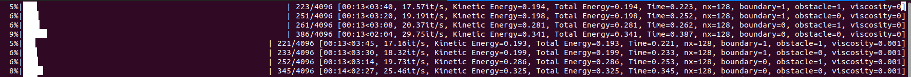

# Generating a dataset for training

In the previous two examples we've seen how we can run a forward simulation and a backward simulation. For many machine learning applications it is also useful to be able to generate a good quality dataset for offline training. The dataset we will build here is similar to our previous weakly compressible setups available [here](https://huggingface.co/datasets/Wi-Re/wcsph_flows_no_slip). These setups are all built on the random flow case we had earlier and start like all simulations but this time all of this is contained in a python script instead of a jupyter notebook.

## Weakly Compressible Generation

This script has quite a few options to make the dataset versatile and useful:
```py
improt argparse
parser = argparse.ArgumentParser(description='Run a regional shock simulation with adaptive smoothing.')

parser.add_argument('--nx', type=int, default=128, help='Number of particles in each dimension.')
parser.add_argument('--gamma', type=float, default=5/3, help='Adiabatic index for the ideal gas EOS.')
parser.add_argument('--timeLimit', type=float, default=4.096, help='Time limit for the simulation in seconds.')
parser.add_argument('--fps', type=int, default=50, help='Frames per second for the output video.')
parser.add_argument('--caseName', type=str, default='wcsph', help='Name of the simulation case.')

parser.add_argument('--velocityNoise', action='store_true', help='Whether to add noise to the initial velocity field.')
parser.add_argument('--octaves', type=int, default=2, help='Number of octaves for the noise field.')
parser.add_argument('--lacunarity', type=int, default=2, help='Lacunarity for the noise field.')
parser.add_argument('--persistence', type=float, default=0.5, help='Persistence for the noise field.')
parser.add_argument('--baseFrequency', type=float, default=4.0, help='Base frequency for the noise field.')
parser.add_argument('--tileable', type=bool, default=True, help='Whether the noise field should be tileable.')
parser.add_argument('--kind', type=str, default='perlin', help='Type of noise to generate.')
parser.add_argument('--seed', type=int, default=4235, help='Seed for the random number generator.')

parser.add_argument('--TGV', type=int, default=1, help='Turbulent kinetic energy for the noise field.')
parser.add_argument('--normalizeEnergy', action='store_true', help='Whether to normalize the energy of the noise field.')
parser.add_argument('--initialEnergyTarget', type=float, default=1.0, help='Target energy for the initial noise field.')

parser.add_argument('--obstacle', action='store_true', help='Whether to include an obstacle in the simulation.')
parser.add_argument('--domainBoundary', action='store_true', help='Whether to use a domain boundary for the simulation.')
parser.add_argument('--boundaryViscosity', type=float, default=0.001, help='Viscosity for the boundary particles.')
parser.add_argument('--export', action='store_true', help='Whether to export the simulation data to a file.')

parser.add_argument('--rho0', type=float, default=1.0, help='Initial density of the particles.')
parser.add_argument('--Pinitial', type=float, default=1.0, help='Initial pressure of the particles.')
parser.add_argument('--dt', type=float, default=1e-3, help='Time step for the simulation.')

parser.add_argument('--verbose', action='store_true', help='Whether to print verbose output during the simulation.')

parser.add_argument('--integrationScheme', type=str, default='symplecticEuler', choices=['rungeKutta2', 'Euler'], help='Integration scheme to use.')
parser.add_argument('--kernelType', type=str, default='B7', choices=['CubicSpline', 'CubicSpline'], help='Kernel type to use.')

parser.add_argument('--gpu', type=int, default=0, help='GPU index to use for the simulation.')
parser.add_argument('--gpus', type=int, default=1, help='Number of GPUs.')
parser.add_argument('--cs', type=float, default=20, help='Speed of sound for the simulation.')

args = parser.parse_args()
```

Many of these control parameters you already saw before but are now exposed to the command line. Some parameters are new and will be explained when they come up. The first important difference is the domain boundary:

```py
band = 4 if domainBoundary else 0

domain = buildDomainDescription(l = L + dx * (band) * 2, dim = dim, periodic = True, device = device, dtype = dtype)
interiorDomain = buildDomainDescription(l = L, dim = dim, periodic = not domainBoundary, device = device, dtype = dtype)

fluid_sdf = lambda x: sampleDomainSDF(x, domain, invert = True)
domain_sdf = lambda x: sampleDomainSDF(x, interiorDomain, invert = False)
obstacle_sdf = lambda points: sampleSDF(points, lambda x: getSDF('circle')['function'](x, torch.tensor(1/4).to(points.device)), invert = False)

box_sdf = lambda points: sampleSDF(points, lambda x: getSDF('box')['function'](x, torch.tensor([0.5,0.5]).to(points.device)))

inlet_sdf = lambda points: sampleSDF(points, operatorDict['translate'](lambda x: getSDF('box')['function'](x, torch.tensor([0.125,0.125]).to(points.device)), torch.tensor([-0.5,0.5]).to(points.device)), invert = False)
outlet_sdf = lambda points: sampleSDF(points, operatorDict['translate'](lambda x: getSDF('box')['function'](x, torch.tensor([0.125,0.125]).to(points.device)), torch.tensor([0.5,-0.5]).to(points.device)), invert = False)
outletBuffer_sdf = lambda points: sampleSDF(points, operatorDict['translate'](lambda x: getSDF('box')['function'](x, torch.tensor([0.25,0.25]).to(points.device)), torch.tensor([0.5,-0.5]).to(points.device)), invert = False)

regions = []

if domainBoundary:
    regions.append(buildRegion(sdf = domain_sdf, config = config, type = 'boundary', kind = 'constant'))
if obstacle:
    regions.append(buildRegion(sdf = obstacle_sdf, config = config, type = 'boundary', kind = 'zero'))
regions.append(buildRegion(sdf = fluid_sdf, config = config, type = 'fluid'))
```

Which is a band of 4 particles placed outside of the fluid domain $[-1,1]^2$ if `domainBoundary` is set to true. This number of layers needs to be adjusted for larger support radii and is based around the mDBC boundary handling scheme for weak compressibility. If we use the domain boundary, we also need to expand the simulation domain to contain these particles as well! 

To generate the initial velocities we built a set of two helper functions that either generate the divergence free noise or a TGV like initial condition, which both utilize potential fields with ramping for correct handling at boundaries. For this case, the ramp is always set to 0.25 physical space units to ensure no introduction of high velocities near the boundaries from sharp gradients in the potential field.

```py
if args.velocityNoise:
    velocities, potential, ramp = sampleDivergenceFreeNoise(particleState, domain, config, nx * 2, smoothingSteps = 4, octaves = octaves, lacunarity = lacunarity, persistence = persistence, baseFrequency = baseFrequency, tileable = tileable, kind = kind, seed = seed)
    # fig, axis = plotSampling(particleState, domain, config, velocities, ramp, potential, s = s)
else:
    velocities, potential, ramp = sampleTGV(particleState, domain, config, k_ = 2, smoothingSteps = 4)
    # fig, axis = plotSampling(particleState, domain, config, velocities, ramp, potential, s = s)
```

The random velocity field function is configured using the command line arguments for the noise generation. Both approaches also apply an optional set of 4 SPH smoothing interpolations on the potential field ramp to ensure smoother velocity fields. An important element for offline learning is consistency in the data. This means that for our default case here we set the maximum particle velocity to $1$ and scale all particle velocities equally to match this. However, for cases with boundaries this results in a significantly lower initial kinetic energy as not all particles are moving and particles near the boundary are stationary. As an alternative for our dataset generation we provide a normalizeEnergy option that ensures the initial kinetic enregy is always the same.

```py

if args.normalizeEnergy:
    # particleState.velocities /= E_k0.sum().sqrt()
    particleState.velocities *= args.initialEnergyTarget / E_k0.sum().sqrt()
    totalInitialEnergy = E_k0.sum()

    if args.verbose:
        print(f'Velocity Magnitudes: min: {particleState.velocities.norm(dim = -1).min().item()}, max: {particleState.velocities.norm(dim = -1).max().item()}, mean: {particleState.velocities.norm(dim = -1).mean().item()}')

        print(f'Total initial energy: {totalInitialEnergy.item()}')
```

Note that this leads to much higher per-particle velocities, which is both more challenging to handle for neural networks and also requires smaller timesteps to not violate the CFL condition. To check if our chosen timestep for the dataset is feasible we next do a comparison

```py
maxVelocity = particleState.velocities.norm(dim = -1).max().item()
c_s_CFL = 0.35 * volumeToSupport(dx**2, targetNeighbors, 2) / Kernel_Scale(kernel, 2) / targetDt

if config['fluid']['c_s'] < maxVelocity * 10:
    print(f'Warning: Speed of sound {config["fluid"]["c_s"]} is too low for maximum velocity {maxVelocity}. Increase c_s or decrease max velocity.')
if config['fluid']['c_s'] >= c_s_CFL:
    print(f'Warning: Speed of sound {config["fluid"]["c_s"]} is too high for CFL condition {c_s_CFL}. Decrease c_s or increase targetDt.')
```

In the first case the chosen timestep results in a numerical speed of sound that is too low and would violate the Mach number constraint of weak compressibility. In the second case the chosen speed of sound is greater than allowed by the CFL condition and needs to be lowered.

## Data Export

To export our particle data we first need to pick a filename
```py
fileName = f'{args.caseName}_{args.domainBoundary}_{args.obstacle}_{args.TGV}_{nx**2}_{timestamp}_{args.seed}'
imagePrefix = f'{args.exportDir}/images/{fileName}/'
exportName = f'{args.exportDir}/data/{fileName}.h5'

if args.export:
    os.makedirs(os.path.dirname(exportName), exist_ok = True)
```

And then we can create the simulation file using pyhdf5 and write out the initial particle data
```py
if args.export:
    outFile = initializeOutputFile(exportName, actualState, config,simulationName='testData')
    outGroup = outFile['simulationData']
    writeParticleData(outGroup, actualState, step = 0, dt = dt)
```

We then also add all the command line arguments and some other useful state information to the file as metadata to make the data usable on its own, e.g.,
```py
    outFile['caseSpecificData'].attrs['caseName'] = args.caseName
    outFile['caseSpecificData'].attrs['nx'] = nx
    outFile['caseSpecificData'].attrs['rho0'] = rho0
```

The writeParticleData function here writes out the full particle state, which requires quite a significant amount of memory but is useful for the first state to provide values for all constant over time attributes, e.g., masses and (in this case) support radii. For the actual simulation data we will utilize `writeParticleDataMinimal`, which only writes out dynamic information. 

To enable tracking the progress of the simulation we build a set of progress bars

```py
gtqdms = []
import portalocker
with portalocker.Lock('README.md', flags = 0x2, timeout = None):
    for g in range(args.gpus):
        gtqdms.append(tqdm(range(timesteps), position = g, leave = True))

tq = gtqdms[args.gpu]
tq.reset()
tq.total = timesteps
```

Where we utilize the readme file as a mutex to ensure synchronous writing to the console. This is also why it was necessary to provide a gpu and gpus argument to this script so that the progress bars can be correctly displayed. The remainder of the file proceeds as normal with running the simulation, plotting if desired, and finally closing the output file. 

## Dataset Generation

To generate a dataset we can now run a piece of code to generate our initial conditions:
```py
cases = 16
c_s = 10
normalizeEnergy = False
n = 128
dt = 1e-3
seeds = np.random.randint(0, 2**32 - 1, size = cases)

for i in range(cases):
    print(f'clear && python wcflows.py {"--normalizeEnergy" if normalizeEnergy else ""} --cs {c_s} --nx {n} --dt {dt} --velocityNoise --seed {seeds[i]} --no-plot --export --exportDir /mnt/ssdraid/rene/datasets/weaklyCompressible/noSlipv3/')
    print(f'clear && python wcflows.py {"--normalizeEnergy" if normalizeEnergy else ""} --cs {c_s} --obstacle --nx {n} --dt {dt} --velocityNoise --seed {seeds[i]} --no-plot --export --exportDir /mnt/ssdraid/rene/datasets/weaklyCompressible/noSlipv3/')
    print(f'clear && python wcflows.py {"--normalizeEnergy" if normalizeEnergy else ""} --cs {c_s} --domainBoundary --nx {n} --dt {dt} --velocityNoise --seed {seeds[i]} --no-plot --export --exportDir /mnt/ssdraid/rene/datasets/weaklyCompressible/noSlipv3/')
    print(f'clear && python wcflows.py {"--normalizeEnergy" if normalizeEnergy else ""} --cs {c_s} --domainBoundary --obstacle --nx {n} --dt {dt} --velocityNoise --seed {seeds[i]} --no-plot --export --exportDir /mnt/ssdraid/rene/datasets/weaklyCompressible/noSlipv3/')
    print(f'clear && python wcflows.py {"--normalizeEnergy" if normalizeEnergy else ""} --cs {c_s} --nx {n} --dt {dt} --velocityNoise --seed {seeds[i]} --boundaryViscosity 0.00 --no-plot --export --exportDir /mnt/ssdraid/rene/datasets/weaklyCompressible/freeSlipv3/')
    print(f'clear && python wcflows.py {"--normalizeEnergy" if normalizeEnergy else ""} --cs {c_s} --obstacle --nx {n} --dt {dt} --velocityNoise --seed {seeds[i]} --boundaryViscosity 0.00 --no-plot --export --exportDir /mnt/ssdraid/rene/datasets/weaklyCompressible/freeSlipv3/')
    print(f'clear && python wcflows.py {"--normalizeEnergy" if normalizeEnergy else ""} --cs {c_s} --domainBoundary --nx {n} --dt {dt} --velocityNoise --seed {seeds[i]} --boundaryViscosity 0.00 --no-plot --export --exportDir /mnt/ssdraid/rene/datasets/weaklyCompressible/freeSlipv3/')
    print(f'clear && python wcflows.py {"--normalizeEnergy" if normalizeEnergy else ""} --cs {c_s} --domainBoundary --obstacle --nx {n} --dt {dt} --velocityNoise --seed {seeds[i]} --boundaryViscosity 0.00 --no-plot --export --exportDir /mnt/ssdraid/rene/datasets/weaklyCompressible/freeSlipv3/')
```

This will generate 128 simulations, each with 16K particles that will contain 4096 timesteps each. The initial conditions are varied between no boundaries, a center obstacle, only domain boundary, domain boundary and obstacle, and we generate  both no slip and free slip cases.

We can then run this script using our scheduler (which you can find in the examples directory) by running
```bash
python scheduler.py --gpus 0 1 2 3 4 5 6 7 < batch.sh
```



Which will run the data generation in parallel on 8 GPUs (1 GPU per simulation). On our system, with a set of RTX A5000 GPUs, this will take approximately 3 minutes per simulation so the entire generation will take 48 minutes. Each simulation will be around 1.3-1.6GByte, depending on the number of boundary particles.

We then also generate a set of TGV like simulations as testing cases:

```py
ks = [2, 4]
for k in ks:
    print(f'clear && python wcflows.py {"--normalizeEnergy" if normalizeEnergy else ""} --cs {c_s} --nx {n} --dt {dt} --TGV {k} --no-plot --export --exportDir /mnt/ssdraid/rene/datasets/weaklyCompressible/noSlipTGV/')
    print(f'clear && python wcflows.py {"--normalizeEnergy" if normalizeEnergy else ""} --cs {c_s} --obstacle --nx {n} --dt {dt} --TGV {k} --no-plot --export --exportDir /mnt/ssdraid/rene/datasets/weaklyCompressible/noSlipTGV/')
    print(f'clear && python wcflows.py {"--normalizeEnergy" if normalizeEnergy else ""} --cs {c_s} --domainBoundary --nx {n} --dt {dt} --TGV {k} --no-plot --export --exportDir /mnt/ssdraid/rene/datasets/weaklyCompressible/noSlipTGV/')
    print(f'clear && python wcflows.py {"--normalizeEnergy" if normalizeEnergy else ""} --cs {c_s} --domainBoundary --obstacle --nx {n} --dt {dt} --TGV {k} --no-plot --export --exportDir /mnt/ssdraid/rene/datasets/weaklyCompressible/noSlipTGV/')
    print(f'clear && python wcflows.py {"--normalizeEnergy" if normalizeEnergy else ""} --cs {c_s} --nx {n} --dt {dt} --TGV {k} --boundaryViscosity 0.00 --no-plot --export --exportDir /mnt/ssdraid/rene/datasets/weaklyCompressible/freeSlipTGV/')
    print(f'clear && python wcflows.py {"--normalizeEnergy" if normalizeEnergy else ""} --cs {c_s} --obstacle --nx {n} --dt {dt} --TGV {k} --boundaryViscosity 0.00 --no-plot --export --exportDir /mnt/ssdraid/rene/datasets/weaklyCompressible/freeSlipTGV/')
    print(f'clear && python wcflows.py {"--normalizeEnergy" if normalizeEnergy else ""} --cs {c_s} --domainBoundary --nx {n} --dt {dt} --velocityNoise --TGV {k} --boundaryViscosity 0.00 --no-plot --export --exportDir /mnt/ssdraid/rene/datasets/weaklyCompressible/freeSlipTGV/')
    print(f'clear && python wcflows.py {"--normalizeEnergy" if normalizeEnergy else ""} --cs {c_s} --domainBoundary --obstacle --nx {n} --dt {dt} --velocityNoise --TGV {k} --boundaryViscosity 0.00 --no-plot --export --exportDir /mnt/ssdraid/rene/datasets/weaklyCompressible/freeSlipTGV/')
```

Which generates an additional 16 simulations. We also have a script to build compressible simulations using an initally random velocity field, random pressure and density fields, and a two regions, four regions and a case with a spherical initial region contained in a larger periodic domain. For the region cases the initial density and pressure of each phase is randomized. This gives another 60 simulations, each of which takes around 15 minutes to run but uses the same spatial and temporal resolution as the weakly compressible case. However, these cases require significantly more data (storing internal energy and time varying support radii), which makes the datasets larger

You can find the full datasets for 16K particles ($128^2$) on hugging face. We also include a set of 4 data samples for 1024 particles for demonstration purposes in our repository under `./exampleData/`.

## Visualizing the dataset

To visualize the dataset you can use our included dataloader (which can also be extracted straightforwardly from our repo). This dataloader supports loading data generation from this simulation, previous datasets that were part of SFBC and the Lagrangebench style of data. First the usual imports:

```py
%matplotlib widget
import torch
import numpy as np
import matplotlib.pyplot as plt
from diffSPH.dataLoader import *
from diffSPH.plotting import visualizeParticles, updatePlot
```

We then configure what kind of data we would like to load:

```py
configuration = DataConfiguration(
    frameDistance=1,
    frameSpacing=1,
    maxRollout=1,
    historyLength=1,
    skipInitialFrames=0,
    cutoff=0
)
```

This configuration allows for temporal coarse graining via the frameDistance parameter, subsampling via frameSpacing, including an unroll trajectory of length maxRollout, including the historyLength prior states and an option to skip initial or final steps of a simulation. This data can then be used to process a data folder:

```py
processed = processFolder(folder, configuration)
```

From which we can generate a dataset and dataset loader with support for batching and shuffling the frame order:

```py
dataset, datasetLoader = getDataLoader(processed, 4, shuffle = True)
datasetIter = iter(datasetLoader)
``` 

We can then load data either via a batch  index (gotten via next(datasetIter)), or by directly providing a filename and frame key:

```py
priorStates, currentState, trajectoryStates, domains, rotMats, configs, neighborhoods = loadAugmentedBatch(
    dataset, [(processed[0]['fileName'],'%06d'%0)], configuration, device = 'cuda', dtype = torch.float32,
    augmentAngle = False,
)
``` 

This loaded state contains all batches combined together and is in a slightly different format than the simulation data, but converting between them should be straightforward if you want to rerun a simulation from a given frame. We can then create an interactive plotting with dropdowns to select the file and frame:


Next up, training a network on the loaded data.