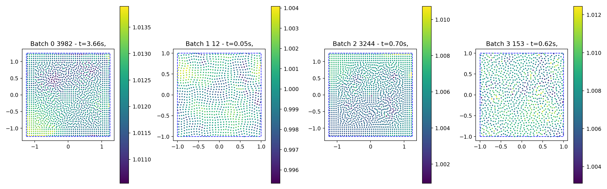
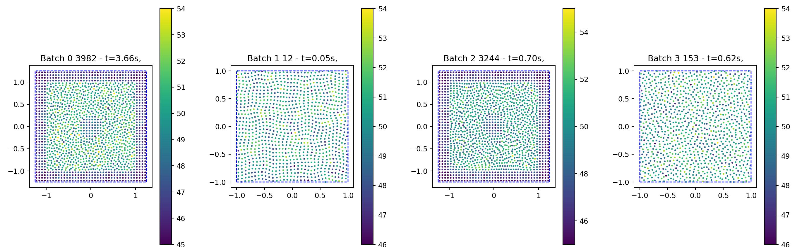
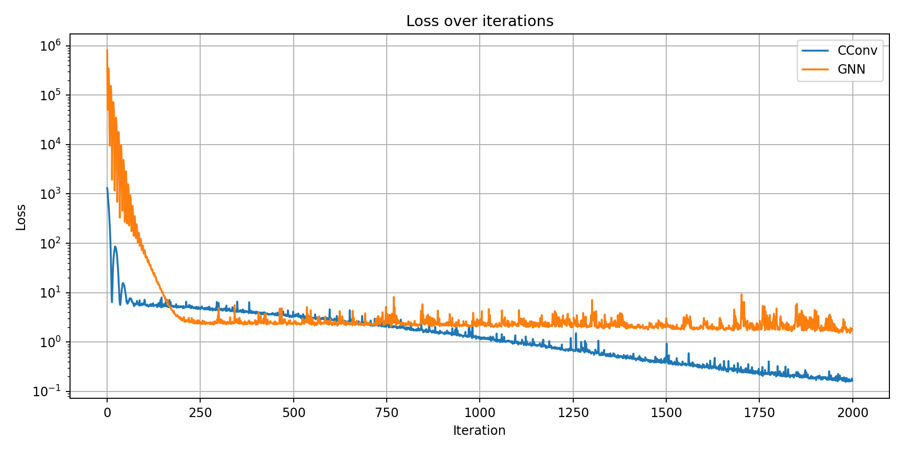
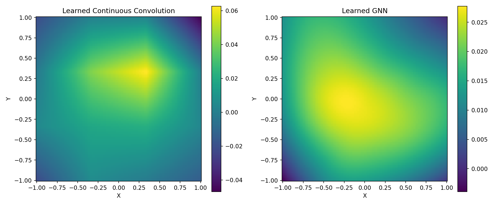

# Training a network

We've now run a simulation forward and backwards and created a dataset. Now it's time to learn something on this dataset! Before we can do this, you should install the Symmetric Basis Function Convolution package to get support for continuous convolution and message passing layers via

```bash
pip install BasisConvolution
```

## Loading the dataset

First the usual imports and then loading the dataset as described before:

```py
%matplotlib widget
import torch
import matplotlib.pyplot as plt
import warnings
from tqdm import TqdmExperimentalWarning
warnings.filterwarnings("ignore", category=TqdmExperimentalWarning)
from tqdm.autonotebook import tqdm
from diffSPH.plotting import visualizeParticles, updatePlot
from diffSPH.operations import sph_op
from diffSPH.kernels import getSPHKernelv2

from diffSPH.dataLoader import *
from BasisConvolution.convLayerv3 import BasisConvLayer

configuration = DataConfiguration(
    frameDistance=1,
    frameSpacing=1,
    maxRollout=1,
    historyLength=1,
    skipInitialFrames=0,
    cutoff=0
)
folder = './exampleData/'


processed = processFolder(folder, configuration)

for file in processed:
    print(f'File: {file["fileName"]}, FrameCount: {len(file["frames"])}, Samples: {len(file["samples"])}, Style: {file["style"]}, Number of samples: {len(processed[0]["samples"])}, first sample: {processed[0]["samples"][0]}, last sample: {processed[0]["samples"][-1]}')

dataset, datasetLoader = getDataLoader(processed, 4, shuffle = True)
datasetIter = iter(datasetLoader)
```

Then lets make sure the data looks like it loaded correctly:

```py
nextData = next(datasetIter)

priorStates, currentState, trajectoryStates, domains, rotMats, configs, neighborhoods = loadAugmentedBatch(
    dataset, nextData, configuration, device = 'cuda', dtype = torch.float32,
    augmentAngle = False,
)

fig, axis = plt.subplots(1, len(nextData), figsize=(len(nextData) * 4, 5), squeeze = False)
# filteredNeighborhood = filterNeighborhoodByKind(currentStates[0], neighborhoods[0], 'noghost')

plots = []
axes = axis.flatten()
for b in range(len(domains)):
    plot = visualizeParticles(fig, axes[b],
                              particles = currentState,
                              domain = domains[b],
                              quantity = currentState.densities,
                              which = 'both',
                              mapping = 'L2',
                              cmap = 'viridis',
                              visualizeBoth=True,
                              kernel = kernelNameToKernel(configs[b]['kernel']),
                              plotDomain = True,
                              gridVisualization=False, markerSize=2,
                              batch = b, streamLines = False)
    axes[b].set_title(f'Batch {b} {nextData[b]} - t={currentState.time[b]:.2f}s,')
    plots.append(plot)

fig.tight_layout()
```

This will look something like this (the specific frames will depend on randomization and your choice of dataset):




And then let us also check if the neighborhoods look correct by counting the number of neighbors per particle and running an SPH interpolation

```py
def evalDensity(state, neighborhood, domains, config):
    quantity = torch.ones_like(state.densities)

    return sph_op(
        state, state, domains, getSPHKernelv2('Wendland2'), neighborhood, quantity = state.velocities, supportScheme='gather', operation = 'density'
    )

filteredNeighborhood = filterNeighborhoodByKind(currentState, neighborhoods, 'noghost')
filtered_csr = coo_to_csr(filteredNeighborhood)
print(f'Filtered neighborhood: {filtered_csr}')

rho = evalDensity(currentState, filteredNeighborhood, domains, configs[0])

for b in range(len(domains)):
    updatePlot(plots[b], particles = currentState, quantity = filtered_csr.rowEntries, mapping = 'L2', cmap = 'viridis')
```

Which will look something like this:



## Building a simple CConv network

For testing purposes lets build a simple network that consists of a single convolution layer with support for continuous convolutions and MLPs:

```py
def buildNetwork(
        mode = 'conv',
        basis = 'linear',
        basisTerms = 4,
        layerCount = 2,
        layerWidth = 128,
        inputFeatures = 1,
        outputFeatures = 1,
        dim = 2
):
    testLayerGNN = BasisConvLayer(
    inputFeatures = inputFeatures,
    outputFeatures = outputFeatures,
    dim = dim,

    basisTerms = basisTerms,
    basisFunction = basis,
    basisPeriodicity = False,

    biasActive= False,
    cutlassBatchSize= 16,

    mode = mode, edgeSkip = 'none', mlpProperties = {
            'activation': 'celu',
            'gain': 1,
            'norm': False,
            'preNorm': False,
            'postNorm': False,
            'noLinear': False,
            'bias': False,
            'groups': [1],
            'layout': [layerWidth] * layerCount,
    }).to('cuda', dtype = torch.float32)

    return testLayerGNN
```

An example of this CConv would be a single convolution layer with 4 basis terms and linear interpolation, and a GNN with 2 hidden layers with 128 neurons each for the edge processing:

```py
testLayerCConv = buildNetwork(mode = 'conv', basis = 'linear', basisTerms = 4)
testLayerGNN = buildNetwork(mode = 'mlp', layerCount = 2, layerWidth = 128)
```

## Training the network

For training we first create an optimizer for our layer and an iterator of our dataset

```py
optimizer = torch.optim.Adam(testLayer.parameters(), lr=initialLR)
datasetIter = iter(datasetLoader)
losses = []
```

We can then sample from the dataset and load the entry:

```py
for i in (tq := tqdm(range(iterations), leave = False)):
    try:
        batch = next(datasetIter)
    except StopIteration:
        datasetIter = iter(datasetLoader)
        batch = next(datasetIter)
    nextData = batch

    priorStates, currentState, trajectoryStates, domains, rotMats, configs, neighborhoods = loadAugmentedBatch(
        dataset, nextData, configuration, device = 'cuda', dtype = torch.float32,
        augmentAngle = True,
    )
```

As our training task we want to input features that are all $1$ and predict the SPH summation density (which is a task that should be exactly learnable). For this we first build our features, filter the neighborhood to only contain real interactions (fluid-fluid, boundary-fluid, fluid-boundary), and then compute the distance for all edges and normalize this distance with the support radius in a gather formulation (note that this will not work correctly for compressible datasets!):

```py
inputFeatures = torch.ones_like(currentState.densities).unsqueeze(-1)

filteredNeighborhood = filterNeighborhoodByKind(currentState, neighborhoods, 'noghost')
edge_index = torch.stack([filteredNeighborhood.row, filteredNeighborhood.col])
rij, xij_, h_i, h_j = evalDistanceTensor(filteredNeighborhood)
edge_attr = xij_ / h_i[:,None]
```

We then zero the gradients and run our network forward, as well as running the SPH summation density from before on the data to build our ground truth:

```py
optimizer.zero_grad()
out, _ = testLayer(
    x = [inputFeatures, inputFeatures],
    edge_index = edge_index,
    edge_attr = edge_attr,
    batches = 1,
)

rho = evalDensity(currentState, filteredNeighborhood, domains, configs[0])
gt = rho
gt = gt.reshape(-1, 1)
```

The error then is simply the MSE of the difference between gt and out and we filter this to only be computed for fluid particles:

```py
error = gt - out
error = error[currentState.kinds == 0]

loss = torch.sum(error ** 2)
loss.backward()

optimizer.step()
tq.set_description(f'Loss: {loss.item():.4f} [{nextData}], Density: {torch.mean(gt):.4f} +- {torch.std(gt):.4f}, Output: {torch.mean(out):.4f} +- {torch.std(out):.4f}, {currentState.time}')
losses.append(loss.item())
```

We can then package this all up in a trainLayer function that returns the trained layer and the loss trajectory and train our networks:

```py
testLayerCConvTrained, losses = trainLayer(testLayerCConv, datasetLoader, iterations = 2000, initialLR = 1e-3)
testLayerGNNTrained, lossesGNN = trainLayer(testLayerGNN, datasetLoader, iterations = 2000, initialLR = 1e-3)
```

Both networks should train in less than 5 minutes each and after they are done we can plot their loss curves:

```py
fig, axis = plt.subplots(1, 1, figsize=(10, 5), squeeze = False)

axis[0,0].plot(losses, label = 'CConv')
axis[0,0].plot(lossesGNN, label = 'GNN')
axis[0,0].set_title('Loss over iterations')
axis[0,0].set_xlabel('Iteration')
axis[0,0].set_ylabel('Loss')

axis[0,0].grid(True)
axis[0,0].set_yscale('log')
fig.tight_layout()
```




We can also visualize the learned convolution for a layer:

```py
xx = torch.linspace(-1, 1, 101).to('cuda', dtype = torch.float32)
yy = torch.linspace(-1, 1, 101).to('cuda', dtype = torch.float32)
X, Y = torch.meshgrid(xx, yy, indexing='ij')
edge_attr = torch.stack([X.flatten(), Y.flatten()], dim=-1).to('cuda', dtype = torch.float32)

edge_index = torch.stack([torch.arange(X.numel()).to('cuda'), torch.zeros_like(X).flatten().to(torch.int64)])
inputs = torch.ones_like(X).flatten().unsqueeze(-1).to('cuda', dtype = torch.float32)

outCConv, _ = testLayerCConv(
    x = [inputs, inputs],
    edge_index = edge_index,
    edge_attr = edge_attr,
    batches = 1,
)
outGNN, _ = testLayerGNN(
    x = [inputs, inputs],
    edge_index = edge_index,
    edge_attr = edge_attr,
    batches = 1,
)

fig, axis = plt.subplots(2, 1, figsize=(12, 5), squeeze = False)

axis[0,0].pcolormesh(X.cpu().numpy(), Y.cpu().numpy(), outCConv[:,0].detach().cpu().numpy().reshape(X.shape), shading='auto', cmap='viridis')
axis[0,0].set_title('Learned Continuous Convolution')

axis[0,1].pcolormesh(X.cpu().numpy(), Y.cpu().numpy(), outGNN[:,0].detach().cpu().numpy().reshape(X.shape), shading='auto', cmap='viridis')
axis[0,1].set_title('Learned GNN')

for ax in axis.flatten():
    ax.set_xlabel('X')
    ax.set_ylabel('Y')
    ax.set_aspect('equal')

fig.tight_layout()
```

