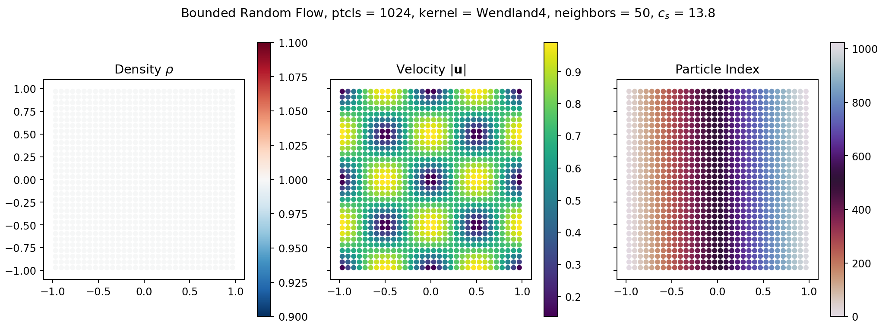
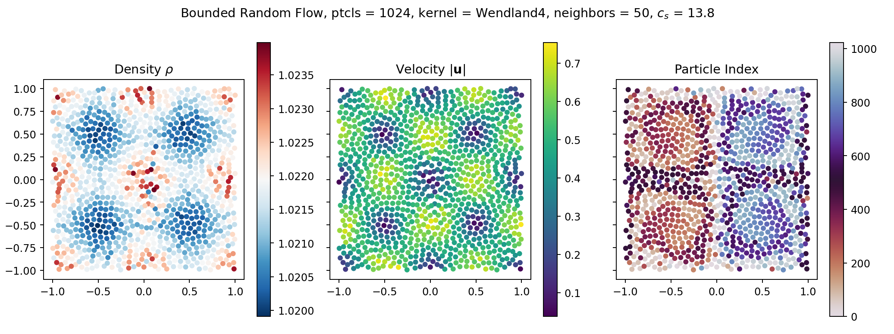
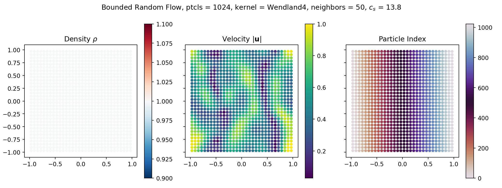
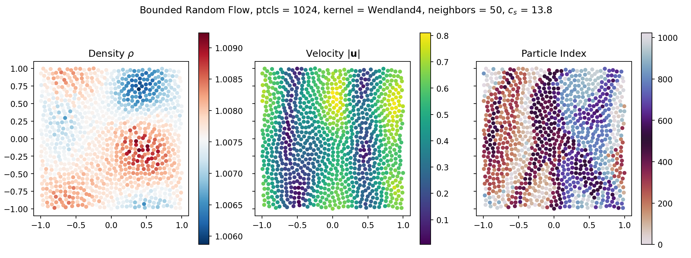
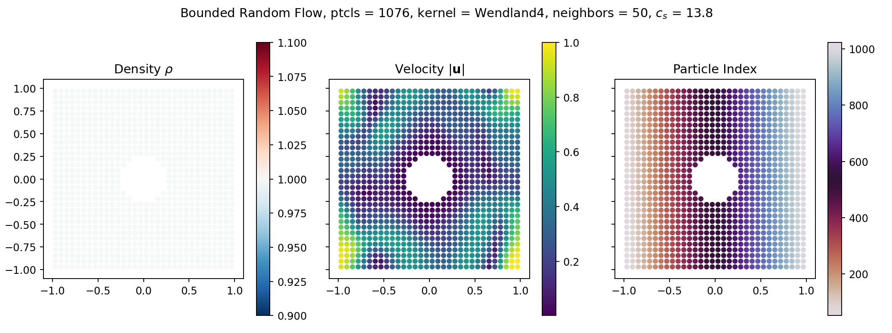
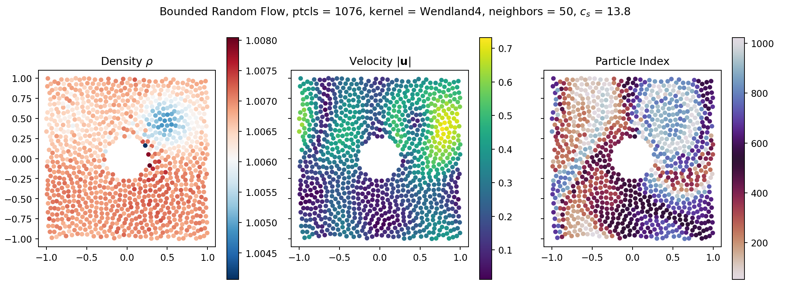

# Setting up a simulation in diffSPH

Now that you have _diffSPH_ installed, its time to setup your first simulation. As the basis for our case here we will utilize a random periodic flow with an obstacle, that we will build upon from the classic Taylor Green Vortex case.

## Getting Started

As usual in a python script and Jupyter we will begin by importing all necessary packages for our simulation

```py
%matplotlib widget
import torch
import warnings
import os
import copy
import math
import numpy as np
import datetime
import matplotlib.pyplot as plt
from tqdm import TqdmExperimentalWarning
warnings.filterwarnings("ignore", category=TqdmExperimentalWarning)
from tqdm.autonotebook import tqdm

if torch.cuda.is_available():
    os.environ['TORCH_CUDA_ARCH_LIST'] = f'{torch.cuda.get_device_properties(0).major}.{torch.cuda.get_device_properties(0).minor}'

from diffSPH.simple import *
```

The simple module of _diffSPH_ includes the imports you will need for most simple simulation cases and is a good starting point to import. You could also include all packages manually but that requires some extra space. The first step is to now define a set of general parameters for your case, in this case we define a simulation name for better visualizations, define the domain size (L being the edge length of the domain), the number of particles, the target timestep and some information useful for export. The freeSurface flag is important to set correctly as free-surface tracking is expensive for quite a few operations and you dont need it here.

```py
simulationName = 'Bounded Random Flow'
currentTime = datetime.datetime.now()
timestamp = currentTime.strftime("%Y-%m-%d_%H-%M-%S")

domainBoundary = False
obstacle = False

L = 2
dim = 2
nx = 32
dx = L / nx
targetDt = 0.0025

rho0 = 1
freeSurface = False

band = 4 if domainBoundary else 0
fps = 50
timeLimit = 4
```

Then we also need to define some SPH specific parameters

```py
kernel = KernelType.Wendland4
scheme = SimulationScheme.DeltaSPH
integrationScheme = IntegrationSchemeType.symplecticEuler

device = torch.device('cuda:0') if torch.cuda.is_available() else torch.device('cpu')
dtype = torch.float32

targetNeighbors = n_h_to_nH(4, dim)
```

For this weakly compressible case you can only use the DeltaSPH scheme. The kernel function and integration scheme are free-to-choose however. The number of neighbors is also a free parameter that here is based on the definition of SPHERAL that uses the number of neighbors per smoothing scale per dimension. Next up, we define some further useful variables for exporting the simulation data

```py
exportInterval = 1 / fps
plotInterval = int(math.ceil(exportInterval / targetDt))
timesteps = int(timeLimit / targetDt)

imagePrefix = f'./images/{caseName}_{nx**dim}_{timestamp}/'
exportName = f'./data/{caseName}_{nx**dim}_{timestamp}.h5'
# os.makedirs(os.path.dirname(exportName), exist_ok = True) # Not needed for this demo
# os.makedirs(imagePrefix, exist_ok = True) # Not needed for this demo
```

Now that we have the general setup defined, we can move to creating the simulation domain and building our simulator. To do this we first build the domain of the simulation using the `buildDomainDescription` function that is built based on the parameters we described above:

```py
domain = buildDomainDescription(l = L + dx * (band) * 2, dim = dim, periodic = True, device = device, dtype = dtype)
interiorDomain = buildDomainDescription(l = L, dim = dim, periodic = not domainBoundary, device = device, dtype = dtype)
```

We then build our simulation and integration schemes:

```py
wrappedKernel = kernel
simulator, SimulationSystem, config, integrator = getSimulationScheme(
     scheme, kernel, integrationScheme, 
     1.0, targetNeighbors, domain)
```

And finally complete our configuration using our case specific parameters:

```py
c_s = 0.3 * volumeToSupport(dx**dim, targetNeighbors, dim) / Kernel_Scale(kernel, dim) / targetDt
config['particle'] = {
    'nx': nx + 2 * band,
    'dx': L/nx,
    'targetNeighbors': targetNeighbors,
    'band': band
}
config['fluid'] = {
    'rho0': rho0,
    'c_s': c_s
}
config['surfaceDetection']['active'] = freeSurface
config['shifting']['freeSurface'] = freeSurface
```

## Initial Conditions

At this point it is also worth checking if your speed of sound makes sense. The value here is computed using a fairly conservative CFL number of 0.3 and should be at least $10\times$ as high as your highest expected particle velocity to remain in the weakly compressible regime. If everything looks good, we can start building our fluid and boundary particles. For now, there are no boundary particles so we can simply build a region based on the domain and use it to initialize the simulation:

```py
fluid_sdf = lambda x: sampleDomainSDF(x, domain, invert = True)
regions.append(buildRegion(sdf = fluid_sdf, config = config, type = 'fluid'))
region = filterRegion(region, regions) # Necessary if there are mulitple regions but doesnt hurt to always keep in your script
particleState, config, rigidBodies = initializeSimulation(scheme, config, regions)
```

To create the initial conditions for the Taylor Green Vortex case we use the canonical initial conditions and directly set the particle velocities:

```py
ktgv = 1 # Number of vortices
u_mag = 1 # Maximum particle velocity
particleState.velocities[:,0] =  u_mag * torch.cos(ktgv * np.pi * particleState.positions[:,0] + phaseShift_x) * torch.sin(ktgv * np.pi * particleState.positions[:,1] + np.pi / 2)
particleState.velocities[:,1] = -u_mag * torch.sin(ktgv * np.pi * particleState.positions[:,0] + phaseShift_x) * torch.cos(ktgv * np.pi * particleState.positions[:,1] + np.pi / 2)

print(f'System Speed of Sound: {c_s:.2f}, maximum particle velocity: {torch.max(torch.norm(particleState.velocities, dim=1)):.2f}, Mach number: {torch.max(torch.norm(particleState.velocities, dim=1)) / c_s:.2f}')
```

## Running the simulation

After we have set all the attributes we needed, we can create our simulation system with the updated particle information:
```py
particles = copy.deepcopy(particleState)
particleSystem = DeltaPlusSPHSystem(config['domain'], None, 0., copy.deepcopy(particleState), 'momentum', None, rigidBodies = config['rigidBodies'], regions = config['regions'], config = config)
```

And we are ready to simulate! But first, we setup a plotting state so we can observe what our simulation does:
```py
fig, axis = plt.subplots(1, 3, figsize=(12, 4.5), squeeze=False, sharex=True, sharey=True)

markerSize = 16
fluidParticles = particleSystem.systemState
densityPlot = visualizeParticles(fig, axis[0,0], particles = fluidParticles, quantity = fluidParticles.densities, domain = domain, which = 'fluid', visualizeBoth=False, kernel = config['kernel'], plotDomain = False, cmap = 'RdBu_r', title='Density $\\rho$', markerSize = markerSize)
velocityPlot = visualizeParticles(fig, axis[0,1], particles = fluidParticles, quantity = fluidParticles.velocities, domain = domain, which = 'fluid', visualizeBoth=False, kernel = config['kernel'], plotDomain = False, cmap = 'viridis', title='Velocity $|\\mathbf{u}|$', markerSize = markerSize, mapping = 'L2')
UIDPlot = visualizeParticles(fig, axis[0,2], particles = fluidParticles, quantity = fluidParticles.UIDs, domain = domain, which = 'fluid', visualizeBoth=False, kernel = config['kernel'], plotDomain = False, cmap = 'twilight_r', title='Particle Index', markerSize = markerSize)

fig.suptitle(f'{caseName}, ptcls = {particleState.positions.shape[0]}, kernel = {config["kernel"].name}, neighbors = {config["targetNeighbors"]:.2g}, $c_s$ = {config["fluid"]["c_s"]:.1f}')
fig.tight_layout()
```

This should like this:



Now we can finally run our simulation:
```py
for i in (tq:=tqdm(range(timesteps))):
    actualState, currentState, updates = integrator.function(actualState, dt, simulator, config, priorStep = actualState.priorStep)
    actualState.priorStep = [updates[-1], currentState[-1]]
    if (i % plotInterval == 0 and i > 0) or i == timesteps - 1:
        updatePlot(densityPlot, actualState.systemState, actualState.systemState.densities)
        updatePlot(velocityPlot, actualState.systemState, actualState.systemState.velocities)
        updatePlot(UIDPlot, actualState.systemState, actualState.systemState.UIDs)

        fig.canvas.draw()
        fig.canvas.flush_events()
```

This simulation will take some time to run mostly due to the plotting. Try disabling the plotting and see what difference in speed this makes! The final state will look like this:




## Random velocity fields

To create our random initial velocity field we utilize the divergence free velocity sampling from Bridson (also called Curl noise), which we provide in a simple wrapper function:

```py
velocities = sampleDivergenceFreeNoise(particleState, domain, config, nx * 2, octaves = 3, lacunarity = 2, persistence = 0.5, baseFrequency = 1, tileable = True, kind = 'perlin', seed = 45906734)
particleState.velocities[:] = velocities
```

Now we can recreate our simulation, and plot it again:



And run it:



Feel free to play around with the noise parameters such as the octaves and base frequency and see what kind of changes you can observe.

## Adding boundaries

Now we would like to add an obstacle in the middle of the flow, which for this case is a cylinder:

```py
obstacle_sdf = lambda points: sampleSDF(points, lambda x: getSDF('circle')['function'](x, torch.tensor(1/4).to(points.device)), invert = False)

regions = []
regions.append(buildRegion(sdf = obstacle_sdf, config = config, type = 'boundary', kind = 'zero'))
regions.append(buildRegion(sdf = fluid_sdf, config = config, type = 'fluid'))

for region in regions:
    region = filterRegion(region, regions)
```

Which gives us our final initial conditions:



Something important to point out here is that the random noise sampling takes boundaries into account by rampign the potential field to $0$ near the boundary. The sampling of the TGV we did before did not utilize a potential field but directly set the particle velocities. What do you expect would happen if you run the simulation using the TGV initial conditions without ramping? How would you adjust them to take into account the boundary?

We can now run our final simulation of this tutorial 



## Next steps

If you want to try out things, here are some ideas:

- Change the particle resolution from $nx=32$ to much higher values, which parameters need to be adjusted? (Hint: You need to utilize low Mach numbers for this SPH scheme)
- How could you make the TGV simulation setup work for the obstacle case?
- Are there any observable difference between kernel functions?
- What about different Integration Schemes?