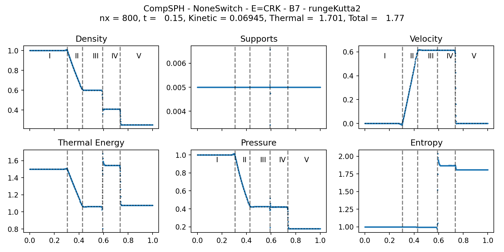
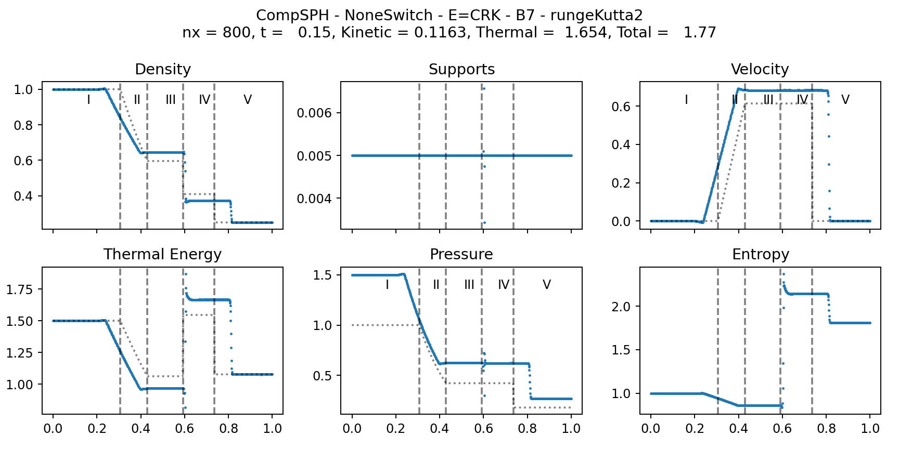
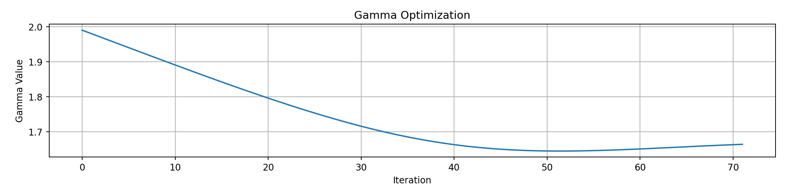
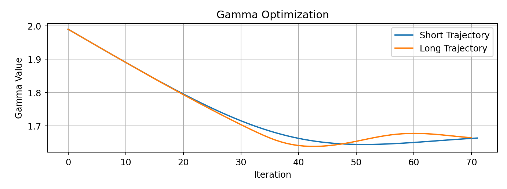

# Solving inverse problems with AD

One of the strengths of _diffSPH_ is its ability to backpropagate through any part of the simulator, which makes it applicable to a broad range of inverse problems. Here we will do a simple demonstration of matching a physical system parameter to a given trajectory.

## The simulation setup

As usual we begin with importing all the packages necessary

```py
%matplotlib widget
import torch
import os
import copy
import matplotlib.pyplot as plt
import warnings
from tqdm import TqdmExperimentalWarning
warnings.filterwarnings("ignore", category=TqdmExperimentalWarning)
from tqdm.autonotebook import tqdm
if torch.cuda.is_available():
    os.environ['TORCH_CUDA_ARCH_LIST'] = f'{torch.cuda.get_device_properties(0).major}.{torch.cuda.get_device_properties(0).minor}'

from diffSPH.simple import *
from diffSPH.reference.sod import buildSod_reference, sodInitialState, generateSod1D, plotSod
```

And set up our initial conitions for the Sod-Shock tube:

```py
nx = 800
dim = 1
gamma = 5/3 # Equation of State parameter

initialStateLeft = sodInitialState(1, 1, 0) # Pressure Density Velocity
initialStateRight = sodInitialState(0.1795, 0.25, 0)
ratio = 1 # Sampling density ratio for adaptive simulations
smoothIC = False # If the initial conditions should be smoothed out
timeLimit = 0.15

domain = buildDomainDescription(l = 2, dim = 1, periodic = True, device = device, dtype = dtype)
```

And the simulation specific parameters:
```py
targetNeighbors = n_h_to_nH(4, 1)

kernel = KernelType.B7
scheme = SimulationScheme.CompSPH
integrationScheme = IntegrationSchemeType.rungeKutta2
viscositySwitch = ViscositySwitch.NoneSwitch
supportScheme = AdaptiveSupportScheme.NoScheme
```

As we are using a compressible simulation for this case there is a broad range of available simulation schemes, e.g., CRKSPH or the classic Monaghan formulation. We default to CompSPH as this scheme is very stable, even under noisy and difficult initial conditions, and provides good gradients in most cases. We can then create our simulator and particle system as per usual:

```py
simulator, SimulationSystem, solverConfig, integrator = getSimulationScheme(
     scheme, kernel, integrationScheme, 
     gamma, targetNeighbors, domain, 
     viscositySwitch=viscositySwitch, supportScheme = supportScheme)
particleSystem = generateSod1D(nx, ratio, initialStateLeft, initialStateRight, gamma, solverConfig['kernel'], targetNeighbors, dtype, device, smoothIC, SimulationSystem)


dt = computeTimestep(scheme, 1e-3, particleSystem.systemState, solverConfig, None)
timesteps = int(timeLimit / dt)
```

We can now generate a reference solution using the _correct_ gamma value:

```py
simulationState = copy.deepcopy(particleSystem)
simulationState.systemState.divergence = torch.zeros_like(simulationState.systemState.densities)
states = []


for i in (tq:=tqdm(range(timesteps))):
    simulationState, currentState, updates = integrator.function(simulationState, dt, simulator, solverConfig, priorStep = simulationState.priorStep)
    simulationState.priorStep = [updates[-1], currentState[-1]]
    
    states.append(copy.deepcopy(simulationState))
```

And visualize the final state 

```py
plotSod(states[-1], config2, states[0].domain, gamma.cpu().item(), initialStateLeft, initialStateRight, plotReference = True, plotLabels = True, scatter = True)
```

For the backpropagation later we will need to store a reference state, which we set to the last state of the simulation:

```py
referenceState = copy.deepcopy(states[-1])
```



## Adding gradients

For our case we would like to optimize the gamma parameter of the equation of state. For this purpose we first make a copy of our simulation configuration and create a tensor for gamma with a _wrong_ value of 2:

```py
config2 = copy.deepcopy(solverConfig)

gamma = torch.tensor([2], dtype=dtype, device=device)
gamma.requires_grad_()

config2['fluid']['gamma'] = gamma
```

With this we can rerun our simulation as before with the only change being that we store the intermediate states with nogradient for now (`states.append(copy.deepcopy(simulationState.nograd()))`). We can then visualize these results (using nograd for plotting as matplotlib and numpy do not support visualizing tensors with gradients):

```py
plotSod(states[-1].nograd(), solverConfig, states[0].domain, solverConfig['fluid']['gamma'], initialStateLeft, initialStateRight, plotReference = True, plotLabels = True, scatter = True)
```



## Backpropagation

Now that we have our reference simulation and a differentiable simulation, all we need to do is wrap the differentiable parameter with an optimizer (Adam in this case) and compute a loss term to minimize. For the loss we simply choose the MSE of the velocity field. This gives us the following code for the setup:

```py
simulationState = copy.deepcopy(particleSystem)
simulationState.systemState.divergence = torch.zeros_like(simulationState.systemState.densities)
states = []

gamma = torch.tensor([2], dtype=dtype, device=device)
gamma.requires_grad_()
gammaIterations = []

optimizer = torch.optim.Adam([gamma], lr = 1e-2)
```

Which we can then optimize by running the simulation forward, computing the loss, running the backwards step and then repeating this iteratively:
```py
for i in (tq:=tqdm(range(1024))):
    optimizer.zero_grad()
    solverConfig['fluid']['gamma'] = gamma
    simulationState = copy.deepcopy(particleSystem)
    simulationState.systemState.divergence = torch.zeros_like(simulationState.systemState.densities)

    for i in (t:=tqdm(range(timesteps), leave=False)):
        simulationState, currentState, updates = integrator.function(simulationState, dt, simulator, solverConfig, priorStep = simulationState.priorStep)
        simulationState.priorStep = [updates[-1], currentState[-1]]
        
    velocityLoss = torch.mean((simulationState.systemState.velocities - referenceState.systemState.velocities)**2)
    velocityLoss.backward()

    optimizer.step()

    tq.set_postfix({
        'Loss': velocityLoss.item(),
        'gamma': gamma.detach().cpu().item(),
        'gamma grad': gamma.grad.detach().cpu().item(),
    })
    gammaIterations.append(gamma.detach().cpu().numpy().copy())
```

Now, this would eventually work but takes a long time to run. For this case we run the simulation forward for 832 timesteps, and then backwards. Even at a decent speed of 100 timesteps/second this requires approximately 17 seconds per iteration and with 1024 iterations of the optimizer this would take around 17000seconds, or 4.7 hours. 

Running gradients through these long trajectories is not always necessary tho and for this demonstration we can run with a much shorter horizon of, e.g., 50 steps, which would reduce the compute time from 17000 seconds to 17 minutes. To do this, let's first build a function that generates a simulation trajectory with a given length:

```py
def runSimulation(timesteps, particleSystem, solverConfig, withGradients = False):
    simulationState = copy.deepcopy(particleSystem)
    simulationState.systemState.divergence = torch.zeros_like(simulationState.systemState.densities)
    states = []

    for i in (tq:=tqdm(range(timesteps), leave = False)):
        simulationState, currentState, updates = integrator.function(simulationState, dt, simulator, solverConfig, priorStep = simulationState.priorStep)
        simulationState.priorStep = [updates[-1], currentState[-1]]
        if withGradients:
            states.append(copy.deepcopy(simulationState))
        else:
            states.append(copy.deepcopy(simulationState.nograd()))

    return states
```

We can then generate our reference solution and run our initial backwards setup again:

```py
targetSteps = 50

referenceState = runSimulation(targetSteps, particleSystem, solverConfig, withGradients = False)[1]

config2 = copy.deepcopy(solverConfig)
gamma = torch.tensor([2], dtype=dtype, device=device)
gamma.requires_grad_()
gammaIterations = []

optimizer = torch.optim.Adam([gamma], lr = 1e-2)
torch.cuda.empty_cache() # Useful to clean up any potential checkpoint information
```

And then run the full inverse setup and lets also add an early termination criterion that will stop the optimizaton if the loss drops below `1e-6`:

```py
for i in (tq:=tqdm(range(1024))):
    optimizer.zero_grad()
    config2['fluid']['gamma'] = gamma
    simulationState = copy.deepcopy(particleSystem)
    simulationState.systemState.divergence = torch.zeros_like(simulationState.systemState.densities)


    states, simulationState = runSimulation(targetSteps, simulationState, config2, withGradients = True)
        
    velocityLoss = torch.mean((simulationState.systemState.velocities - referenceState.systemState.velocities)**2)
    velocityLoss.backward()

    optimizer.step()

    tq.set_postfix({
        'Loss': velocityLoss.item(),
        'gamma': gamma.detach().cpu().item(),
        'gamma grad': gamma.grad.detach().cpu().item(),
    })
    gammaIterations.append(gamma.detach().cpu().numpy().copy())
```

This optimization will finish after around 70 iterations and gives us this optimization trajectory:



So let us run this again with the full trajectory, considering we were done very quickly with this setup and see if the trajectory length influences the optimization significantly:



The convergence behavior we observe here is very similar for the initial 20 iterations after which the long trajectory keeps progressing faster. The process is stopped after 70 iterations, same as the short trajectory, as both reach the desired loss threshold. These results indicate that the gradients, even through long backprop chains, remain useful and practical

## What next

If you would like to try other inverse problems you could:

- See how changing the simulation scheme, e.g., to CRKSPH, influences the result
- Does the temporal integration scheme, kernel function and neighborhood influence the convergence?
- What about other inverse problems, e.g., matching a noisy initial condition to the reference trajectory?

