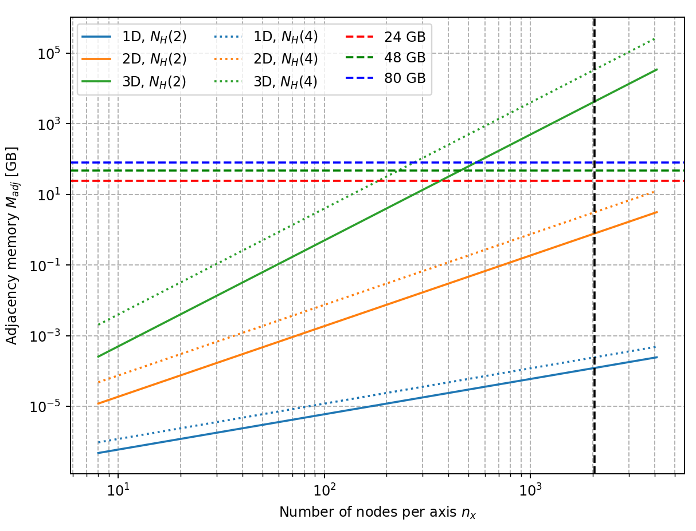
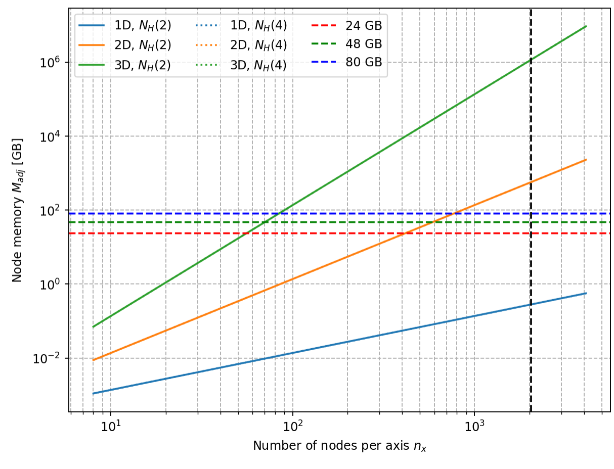
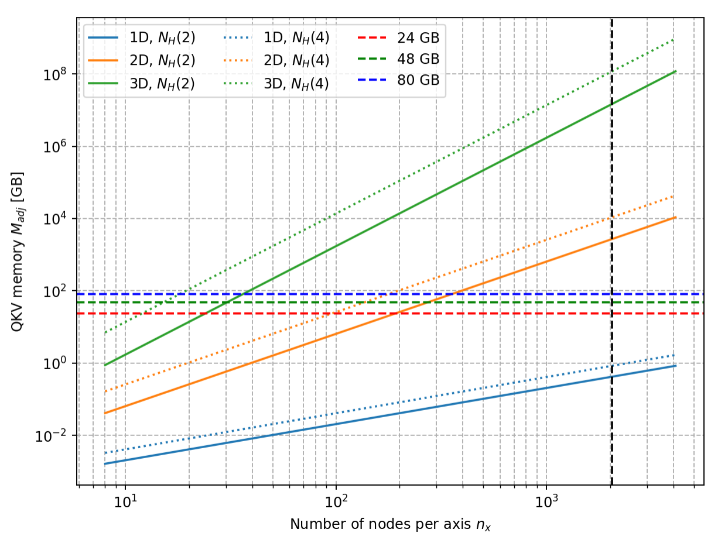

# Memory

Given a domain in $d$ dimensions with $n_x$ nodes per axis, we get $n_x^d$ nodes in total. For a connectivity of $n_h = 4$ (standard in SPH, $n_h$ is the number of neighbors per smoothing scale) we get $N_h = [8, 50, 268]$ in 1, 2 and 3D (in CG style we would go with $8$, $20$ and $50$ respectively). To store the connectivity we need 16 Bytes per connection (COO format for backprop, 8 bytes per entry for torch). This means our adjacency requires:

$$
M_\text{adj} = 16 n_x^d N_h
$$

Now, based on the PDE transformer paper we have the following configurations:

model | H | T | Layers | MLP
---|---|---|---|---
dit_s | 6 | 64 | 12 | 256
dit_l | 16 | 64 | 24 | 256
dit_xl | 16 | 72 | 28 | 288

For the query/key/value computations we need $L=H T$ entries per node, which means that we need $Layers \times H \times T \ times 4$ entries in total per node (each layer requires the input token representation and the 3 outputs). For the FFN we need to store an intermediate of $H\times T$ and $H\times T \times 4$ (4 being the MLP ratio). So in total we need for the node information

$$
M_\text{node} = L \times \left[H\times T \times (4+4)  \right] \times 4
$$

While this is bad, it isn't the worst. For the attention mechanism we need to broadcast the QKV values to the adjacency graph, i.e., we need $n_x^d N_h \times H \times T \times 3 \times 4$. This gives us:

(times the number of layers)